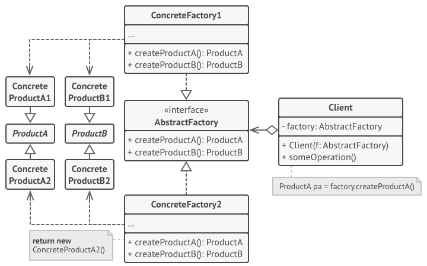
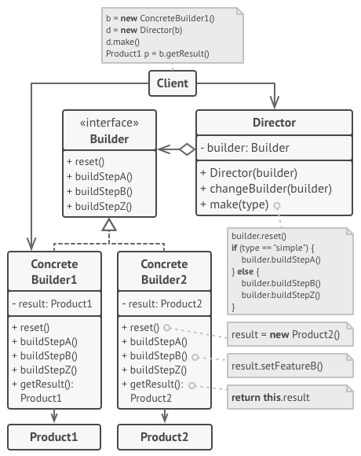

# Gang of Four Design Patterns

The GoF Design Patterns are broken into three categories: Creational Patterns for the creation of objects; Structural Patterns to provide relationship between objects; and finally, Behavioral Patterns to help define how objects interact.

## Creational Design Patterns
1. *Abstract Factory*. Allows the creation of objects without specifying their concrete type.
2. *Builder*. Uses to create complex objects.
3. *Factory Method*. Creates objects without specifying the exact class to create.
4. *Prototype*. Creates a new object from an existing object.
5. *Singleton*. Ensures only one instance of an object is created.
## Structural Design Patterns
6. *Adapter*. Allows for two incompatible classes to work together by wrapping an interface around one of the existing classes.
7. *Bridge*. Decouples an abstraction so two classes can vary independently.
8. *Composite*. Takes a group of objects into a single object.
9. *Decorator*. Allows for an object’s behavior to be extended dynamically at run time.
10. *Facade*. Provides a simple interface to a more complex underlying object.
11. *Flyweight*. Reduces the cost of complex object models.
12. *Proxy*. Provides a placeholder interface to an underlying object to control access, reduce cost, or reduce complexity.
## Behavior Design Patterns
13. *Chain of Responsibility*. Delegates commands to a chain of processing objects.
14. *Command*. Creates objects which encapsulate actions and parameters.
15. *Interpreter*. Implements a specialized language.
16. *Iterator*. Accesses the elements of an object sequentially without exposing its underlying representation.
17. *Mediator*. Allows loose coupling between classes by being the only class that has detailed knowledge of their methods.
18. *Memento*. Provides the ability to restore an object to its previous state.
19. *Observer*. Is a publish/subscribe pattern which allows a number of observer objects to see an event.
20. *State*. Allows an object to alter its behavior when its internal state changes.
21. *Strategy*. Allows one of a family of algorithms to be selected on-the-fly at run-time.
22. *Template Method*. Defines the skeleton of an algorithm as an abstract class, allowing its sub-classes to provide concrete behavior.
23. *Visitor*. Separates an algorithm from an object structure by moving the hierarchy of methods into one object.

## 1. Factory Method
### Guide
https://refactoring.guru/design-patterns/factory-method
### Structure

## 2. Abstract Factory
### Guide
https://refactoring.guru/design-patterns/abstract-factory 
### Structure

## 3. Builder
### Guide
https://refactoring.guru/design-patterns/builder
### Structure

 